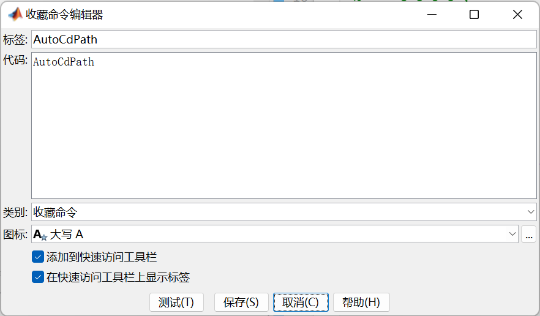

# Utilitaires MATLAB

<p>
	
	
</p>

[Lisez-moi en anglais](https://github.com/Fentaniao/MATLAB-Utilities/blob/main/README.md)•[Lisez-moi en chinois](https://github.com/Fentaniao/MATLAB-Utilities/blob/main/README_zh.md)

Un ensemble d'utilitaires pour alimenter les progrès de développement de MATLAB.

## Utilitaires actuels

### AutoCdPathAutoCdPath

-   Nom du fichier : AutoCdPath.m

-   Fonction : définir automatiquement le chemin actuel sur le chemin du fichier ouvert

-   Commande : AutoCdPath

### UnMlx2M

-   Nom du fichier : OneMlx2M.m

-   Fonction : Transférer le fichier .mlx actuel vers le fichier .m

-   Commande : OneMlx2M

### MultiMlx2M

-   Nom du fichier : MultiMlx2M.m

-   Fonction : Transférer tous les fichiers .mlx du chemin actuel vers le fichier .m

-   Command: MultiMlx2M

### MBeautifier

-   Nom du dossier : MBeautifier-1.3.2

-   Fonction : Formateur de code source MATLAB, embellisseur. Il peut être utilisé directement dans l'éditeur MATLAB et il est configurable.

-   Command: MBeautify.formatCurrentEditorPage()

-   Remarque : se baser sur[MBeautifier](https://github.com/davidvarga/MBeautifier)。

## Installer

### Exigence

dernier que MATLAB R2013b.

#### Télécharger des scripts via GitHub

[Page des versions de GitHub](https://github.com/Fentaniao/MATLAB-Utilities/releases), cliquer sur`Assets`en bas pour afficher les fichiers disponibles dans la version, puis cliquez sur les scripts .m ou le fichier .zip que vous souhaitez télécharger.

#### N'oubliez pas d'ajouter au chemin de recherche MATLAB

## Usage

Voici plus d'une façon d'utiliser ces utilitaires.

### 1.Via la fenêtre de commande

Entrez la commande directement dans la fenêtre de commande.

Par exemple, vous pouvez transférer le chemin actuel vers le chemin du fichier ouvert en entrant la commande dans la fenêtre de commande :

```matlab
AutoCdPath
```

alors vous pouvez trouver un tel résultat dans la fenêtre de commande :

```matlab
AutoCdPath to "C:\Users\username\Documents\Scripts".
```

### 2. Définir la commande des favoris, pointer et utiliser

#### Commande Ajouter aux favoris


#### Commande Modifier les favoris




#### Image d'effet

 

### 3.Incluez le code requis directement dans votre projet

## Contact

Auteur : Fentaniao

E-mail:[Fentaniao@gmail.com](mailto:Fentaniao@gmail.com)

## Licence

[Licence GPL-3.0](https://github.com/Fentaniao/MATLAB-Utilities/blob/main/LICENSE)© Fentaniaov
