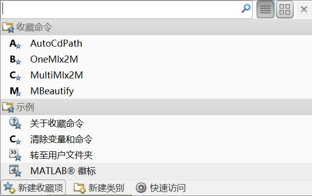

# MATLAB उपयोगिताएँ

<p>
	
	
</p>

[अंग्रेजी रीडमी](https://github.com/Fentaniao/MATLAB-Utilities/blob/main/README.md)•[चीनी रीडमी](https://github.com/Fentaniao/MATLAB-Utilities/blob/main/README_zh.md)

MATLAB विकासशील प्रगति को शक्ति देने के लिए उपयोगिताओं का एक सेट।

## वर्तमान उपयोगिताओं

### ऑटो सीडीपथ

-   फ़ाइल का नाम: AutoCdPath.m

-   फ़ंक्शन: स्वचालित रूप से वर्तमान पथ को खुली हुई फ़ाइल के पथ पर सेट करें

-   कमांड: AutoCdPath

### वनएमएलएक्स2एम

-   फ़ाइल का नाम: OneMlx2M.m

-   समारोह: वर्तमान .mlx फ़ाइल को .m फ़ाइल में स्थानांतरित करें

-   कमांड: OneMlx2M

### मल्टीएमएलएक्स2एम

-   फ़ाइल का नाम: MultiMlx2M.m

-   फ़ंक्शन: सभी .mlx फ़ाइल को वर्तमान पथ में .m फ़ाइल में स्थानांतरित करें

-   कमांड: मल्टीएमएलएक्स2एम

### एमबीसुंदरता

-   फ़ोल्डर का नाम: एमबीब्यूटिफायर-1.3.2

-   समारोह: एक MATLAB स्रोत कोड फ़ॉर्मेटर, ब्यूटिफायर। इसका उपयोग सीधे MATLAB संपादक में किया जा सकता है और यह विन्यास योग्य है।

-   कमांड: MBeautify.formatCurrentEditorPage ()

-   टिप्पणी: आधार पर[एमबीसुंदरता](https://github.com/davidvarga/MBeautifier)。

## इंस्टॉल

### मांग

MATLAB R2013b की तुलना में अंतिम।

#### GitHub के माध्यम से स्क्रिप्ट डाउनलोड करें

[गिटहब पेज जारी करता है](https://github.com/Fentaniao/MATLAB-Utilities/releases), पर क्लिक करें`Assets`नीचे रिलीज में उपलब्ध फाइलों को दिखाने के लिए और फिर .m स्क्रिप्ट या .zip फाइल पर क्लिक करें जिसे आप डाउनलोड करना चाहते हैं।

#### MATLAB खोज पथ में जोड़ना न भूलें

## प्रयोग

यहां इन उपयोगिताओं का उपयोग करने के एक से अधिक तरीके प्रदान किए गए हैं।

### 1. कमांड विंडो के माध्यम से

कमांड विंडो में सीधे कमांड दर्ज करें।

उदाहरण के लिए, आप कमांड विंडो में कमांड दर्ज करके वर्तमान पथ को खुली फ़ाइल के पथ में स्थानांतरित कर सकते हैं:

```matlab
AutoCdPath
```

तो आप कमांड विंडो में ऐसा परिणाम पा सकते हैं:

```matlab
AutoCdPath to "C:\Users\username\Documents\Scripts".
```

### 2. पसंदीदा कमांड पर सेट करें, पॉइंट-एंड-यूज़

#### पसंदीदा कमांड में जोड़ें



#### पसंदीदा कमांड संपादित करें


#### प्रभाव चित्र

 

### 3. अपने प्रोजेक्ट में सीधे आवश्यक कोड शामिल करें

## संपर्क करें

लेखक: फेंटानियाओ

ईमेल:[फ़ेंटानिओ@जीमेल.कॉम](mailto:Fentaniao@gmail.com)

## लाइसेंस

[जीपीएल-3.0 लाइसेंस](https://github.com/Fentaniao/MATLAB-Utilities/blob/main/LICENSE)© Fentaniaov
