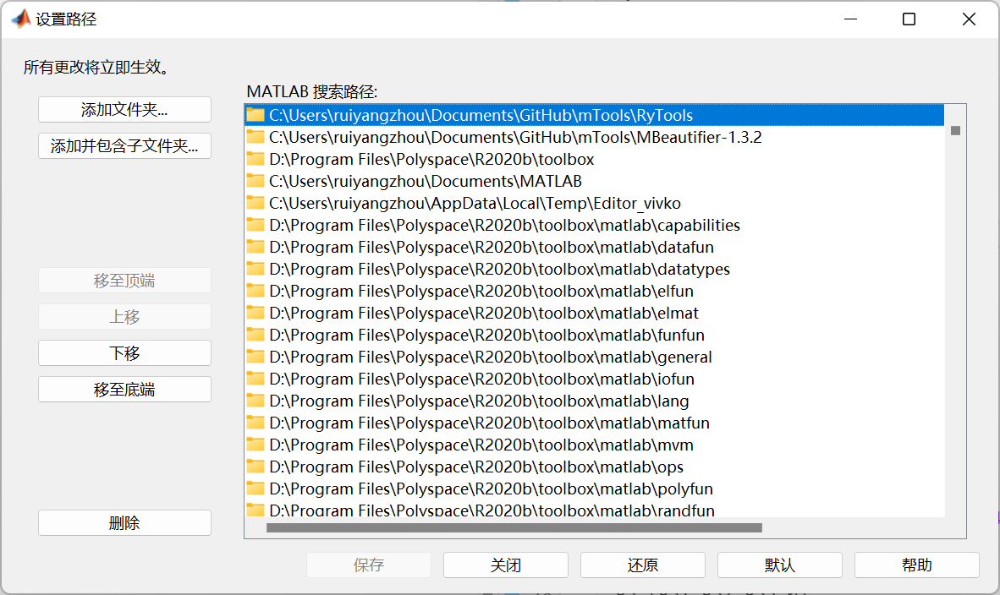

# mTools

## 关于

- 这是一个集成式的matlab工具箱，旨在优化matlab开发流程。
- mTools 项目的诞生离不开[MBeautifier](https://github.com/davidvarga/MBeautifier/tree/v1.3.2)和其他一些开源项目。
- 本项目的GitHub位置：https://github.com/Fentaniao/mTools

## 工具箱内容

| Dir               | .m FileName | Function                           |
| ----------------- | ----------- | ---------------------------------- |
| MBeautifier-1.3.2 | MBeautifier | 格式化.m文件                       |
| RyTools           | AutoCdPath  | 自动设置当前目录                   |
| RyTools           | OneMlx2M    | 自动转换当前.mlx文件为.m文件       |
| RyTools           | MultiMlx2M  | 自动转换目录下所有.mlx文件为.m文件 |
|                   |             |                                    |

## 使用方法

- 设置为收藏夹命令，即点即用
- 直接在项目中包含所需要的代码。

## 配置方法

### 添加到MATLAB路径

### 添加收藏命令

### 写入代码

|  |  |
| ------------------------------------------------------------ | ------------------------------------------------------------ |

### 效果图

