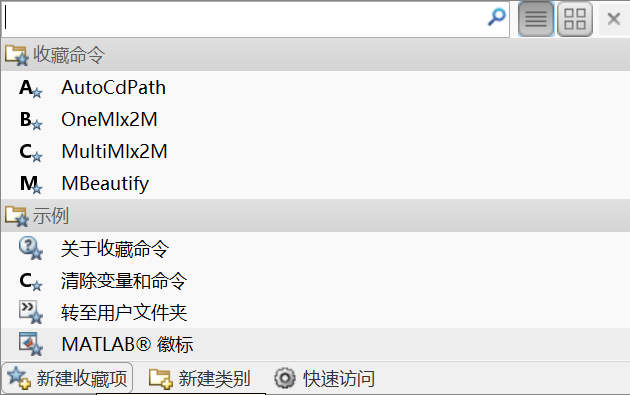
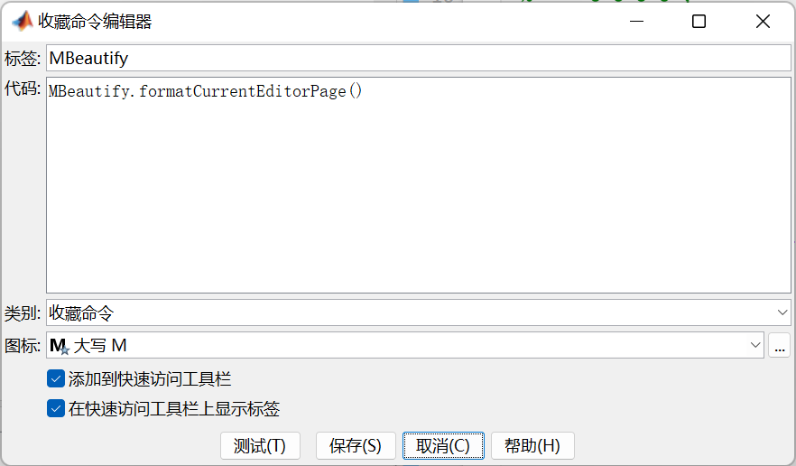
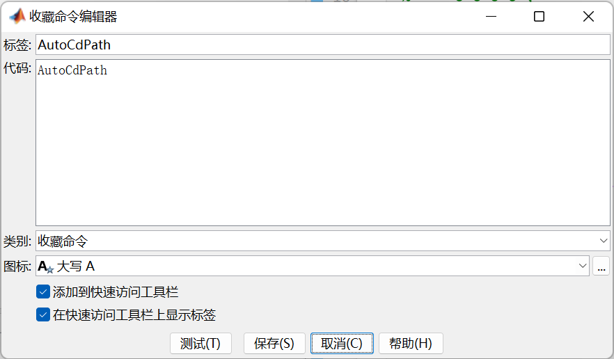

# MATLABUtilities

[English Readme](https://github.com/Fentaniao/MATLABUtilities/blob/main/README.md) · [中文文档](https://github.com/Fentaniao/MATLABUtilities/blob/main/README_zh.md)

这是一组MATLAB实用程序，旨在优化MATLAB开发流程。

## 工具箱内容

### AutoCdPath

- 文件名：AutoCdPath.m

- 功能：自动设置当前目录

- 调用命令：AutoCdPath


### OneMlx2M

- 文件名：OneMlx2M.m

- 功能：自动转换当前.mlx文件为.m文件

- 调用命令：OneMlx2M

### MultiMlx2M

- 文件名：MultiMlx2M.m

- 功能：自动转换目录下所有.mlx文件为.m文件

- 调用命令：MultiMlx2M

### MBeautifier

- 文件夹名称：MBeautifier-1.3.2

- 功能：格式化.m文件

- 调用命令：MBeautify.formatCurrentEditorPage()

- 注：基于[MBeautifier](https://github.com/davidvarga/MBeautifier)项目。

## 安装

### 要求

MATLAB 版本不低于R2013b.

#### 通过GitHub下载脚本

导航到[GitHub releases page](https://github.com/Fentaniao/MATLABUtilities/releases)，点击底部的**Assets**来显示发布版本中可用的文件，然后点击你想要下载的.m 脚本或.zip压缩包。

#### 将脚本所在位置添加到MATLAB搜索路径

## 用法

这里提供了多种方法来使用这些实用程序。

### 通过命令行调用

在命令窗口中直接输入命令。

例如，您可以在命令窗口中输入命令将该目录转移到打开文件的目录下:

```matlab
AutoCdPath
```

然后您可以在命令窗口中直接找到类似这样的运行结果:

```matlab
AutoCdPath to "C:\Users\username\Documents\Scripts".
```

### 设置为收藏夹命令，即点即用

#### 添加到收藏命令



#### 编辑收藏命令





#### 效果图

 

### 直接在项目中包含所需要的代码

## 联系

作者：Fentaniao

邮箱：[Fentaniao@gmail.com](mailto:Fentaniao@gmail.com)

## 开源许可证

[GPL-3.0 License](https://github.com/Fentaniao/MATLABUtilities/blob/main/LICENSE) © Fentaniao
